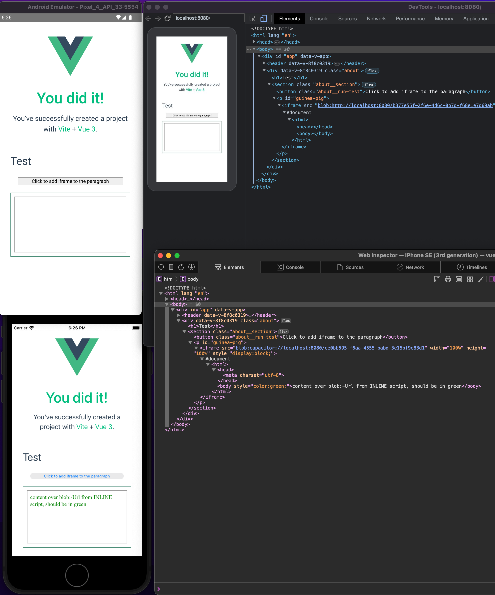

# vue-cap-test

Programmatically attaching iframe with the Blob URL/Object URL source produces an iframe with empty body/content.

The issue is reproducible on Android only, iOS works correctly. The issue cannot be reproduced in Android browser.

## Steps to reproduce

- Build a sample app

        npm install
        npm run cap:android

- On the page click the "Click to add iframe to the paragraph" button. This will create an ObjectURL with the Blob content `<head><meta charset="utf-8"></head><body style='color:green;'>content over blob:-Url from INLINE script, should be in green</body>`. Created ObjectURL will be used as source of an iframe that will be put as innerHTML of the element with id="guinea-pig"
- Check the iframe content, observe that "content over blob:-Url from INLINE script, should be in green" is mot there

